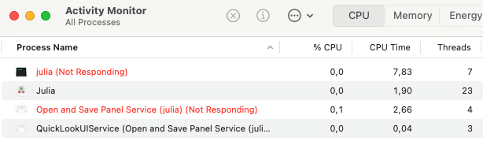

After an upgrade of MacOS to v15 "Sequoia", the package [`NativeFileDialog.jl`](https://github.com/JuliaGraphics/NativeFileDialog.jl) started to cause [problems](https://github.com/JuliaGraphics/NativeFileDialog.jl/issues/14). Depending on usage scenario, this can be just printing some garbage (from user point of view, at least) into the command line, which is mildly annoying. But it can also **reproducibly** crash julia or make it unresponsive in other usage scenarios.

The module `FileDialogWorkAround` tries to work around this by calling osascript/AppleScript through the julia shell. For older MacOS versions, and for other OSes, it falls back to `NativeFileDialog.jl`.

The file `FileDialogWorkAroundExample.jl` demonstrates the usage. Copy the file `FileDialogWorkAround.jl` to your package or project. Important: the packages `NativeFileDialog` and `Dates` must be added to your project, but do not import `NativeFileDialog` into your main environment to avoid name conflicts.

